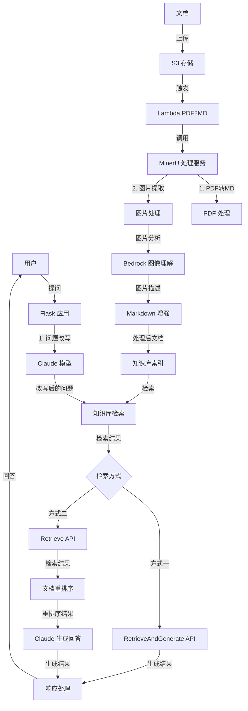

# AWS Bedrock Knowledge Base 智能问答系统

基于 AWS Bedrock 和 Claude 大语言模型的智能问答系统，支持知识库检索、问题改写、文档重排序和流式响应。


## 项目概述

本项目是一个基于 AWS Bedrock 服务和 Claude 大语言模型的智能问答系统，主要用于企业知识库检索和智能问答。系统通过 Flask 框架提供 RESTful API，支持多种检索和生成方式，包括直接使用 AWS Bedrock Knowledge Base 的 RetrieveAndGenerate API，以及自定义的 Retrieve + Rerank + Generate 流程。

### 核心功能

- **问题改写**：使用 Claude 模型优化用户问题，提高检索准确性
- **知识库检索**：从 AWS Bedrock Knowledge Base 中检索相关文档
- **文档重排序**：使用 Cohere Rerank 模型对检索结果进行重排序
- **智能回答生成**：基于检索结果和用户问题，使用 Claude 模型生成高质量回答
- **流式响应**：支持流式响应，提高用户体验
- **文档预处理**：MinerU 工具支持 PDF 转 Markdown、图片提取和智能描述

## 系统架构



## 技术栈

- **后端框架**：Flask, Streamlit
- **AI 模型**：AWS Bedrock Claude (anthropic.claude-3-5-sonnet-20241022-v2:0)
- **知识库**：AWS Bedrock Knowledge Base
- **重排序模型**：Cohere Rerank (cohere.rerank-v3-5:0)
- **图像理解**：AWS Bedrock Nova (us.amazon.nova-pro-v1:0)
- **部署**：Docker, AWS Lambda, Gunicorn (可选)

## 项目结构

```
bedrock-kb/
├── Front/                 # 前端应用目录
│   ├── app.py             # Streamlit 应用入口点
│   ├── claude_handler.py  # Claude 模型处理模块
│   ├── kb_handler.py      # 知识库处理模块
│   ├── rank_handler.py    # 文档重排序模块
│   └── requirements.txt   # 项目依赖
├── Lambda/                # AWS Lambda 函数目录
│   └── pdf2md.py          # PDF 转 Markdown 处理函数
├── MinerU/                # 知识挖掘工具目录
│   ├── api/               # API 接口模块
│   │   ├── __init__.py
│   │   └── app.py         # Flask 应用和 API 端点
│   ├── aws/               # AWS 服务交互模块
│   │   ├── __init__.py
│   │   ├── bedrock_utils.py  # Bedrock API 工具
│   │   ├── clients.py     # AWS 客户端管理
│   │   ├── dynamodb_utils.py # DynamoDB 操作工具
│   │   └── s3_utils.py    # S3 操作工具
│   ├── image/             # 图片处理模块
│   │   ├── __init__.py
│   │   └── processor.py   # 图片处理功能
│   ├── markdown/          # Markdown 处理模块
│   │   ├── __init__.py
│   │   ├── enhancer.py    # Markdown 增强功能
│   │   └── parser.py      # Markdown 解析工具
│   ├── services/          # 业务服务模块
│   │   ├── __init__.py
│   │   ├── markdown_service.py # Markdown 处理服务
│   │   └── pdf_service.py # PDF 处理服务
│   ├── utils/             # 工具函数模块
│   │   ├── __init__.py
│   │   ├── logging_utils.py # 日志工具
│   │   └── memory_utils.py # 内存管理工具
│   ├── config.py          # 配置文件
│   ├── main.py            # 主程序入口
│   ├── README.md          # MinerU 说明文档
│   └── requirements.txt   # 依赖包列表
└── README.md              # 项目说明文档
```

## MinerU 文档处理工具

MinerU 是一个 PDF 和 Markdown 文档处理工具，专注于提取和增强文档中的图片内容。它使用 AWS Bedrock 服务来分析图片并提供智能描述。

### 功能特点

- PDF 文档转换为 Markdown 格式
- 自动处理和优化 Markdown 中的图片引用
- 使用 AWS Bedrock AI 服务分析图片内容
- 为图片添加智能描述和上下文理解
- 高效的并行处理和内存管理

### 处理流程

1. **文档上传**：将 PDF 文档上传到 S3 存储桶
2. **Lambda 触发**：S3 事件触发 Lambda 函数
3. **PDF 转换**：Lambda 调用 MinerU 服务将 PDF 转换为 Markdown
4. **图片提取**：从 Markdown 中提取图片引用
5. **图片分析**：使用 Bedrock 模型分析图片内容
6. **内容增强**：将图片描述添加到 Markdown 文档中
7. **结果存储**：将处理后的 Markdown 文档存储回 S3

## API 文档

### 1. 健康检查

- **端点**：`GET /health`
- **描述**：检查服务是否正常运行
- **响应**：
  ```json
  {
    "status": "healthy"
  }
  ```

### 2. 列出知识库

- **端点**：`GET /list_knowledge_bases`
- **描述**：列出可用的知识库
- **响应**：
  ```json
  {
    "knowledge_bases": [
      {
        "id": "kb-12345",
        "name": "产品手册知识库",
        "description": "包含所有产品手册和技术文档"
      },
      {
        "id": "kb-67890",
        "name": "常见问题知识库",
        "description": "客户常见问题和解答"
      }
    ]
  }
  ```

### 3. 检索并生成回答（非流式）

- **端点**：`POST /retrieve_and_generate`
- **描述**：使用 RetrieveAndGenerate API 检索文档并生成回答
- **请求体**：
  ```json
  {
    "query": "如何更换液压油滤芯？",
    "kb_id": "kb-12345",
    "model_arn": "arn:aws:bedrock:us-west-2::foundation-model/anthropic.claude-3-5-sonnet-20241022-v2:0",
    "enable_rewrite": true,
    "system_prompt": "你是一个专业的技术支持专家",
    "rewrite_prompt": "基于用户的<query>进行优化，理解用户真实意图，将问题进行改写，使问题描述更加清晰\n<query>%s</query>"
  }
  ```
- **响应**：
  ```json
  {
    "result": "要更换液压油滤芯，请按照以下步骤操作：\n\n1. 关闭设备电源并释放系统压力\n2. 找到液压油滤芯位置，通常在液压油箱附近\n3. 使用滤芯扳手逆时针旋转滤芯外壳\n4. 小心取出旧滤芯，注意可能有残余油液\n5. 检查新滤芯密封圈，并在密封圈上涂抹少量干净的液压油\n6. 安装新滤芯，手动顺时针旋转直到密封圈接触底座\n7. 使用滤芯扳手再拧紧3/4圈\n8. 启动设备并检查是否有泄漏\n\n注意：请确保使用与设备型号匹配的原厂滤芯，并遵循设备维护手册中的具体说明。"
  }
  ```

### 4. 检索并生成回答（流式）

- **端点**：`POST /retrieve_and_generate_stream`
- **描述**：使用 RetrieveAndGenerate API 流式检索文档并生成回答
- **请求体**：与非流式相同
- **响应**：Server-Sent Events (SSE) 格式的流式响应
  ```
  data: {"type": "metadata", "rewritten_query": "如何正确更换挖掘机的液压油滤芯？"}
  
  data: {"chunk": "要更换液压油滤芯，请按照以下步骤操作："}
  
  data: {"chunk": "\n\n1. 关闭设备电源并释放系统压力"}
  
  ...
  
  data: [DONE]
  ```

### 5. 检索、重排序并生成回答（非流式）

- **端点**：`POST /retrieve_rerank_generate`
- **描述**：使用 Retrieve API 检索文档，重排序后调用 Claude 生成回答
- **请求体**：
  ```json
  {
    "query": "如何更换液压油滤芯？",
    "kb_id": "kb-12345",
    "rerank_model": "arn:aws:bedrock:us-west-2::foundation-model/cohere.rerank-v3-5:0",
    "enable_rewrite": true,
    "system_prompt": "你是一个专业的技术支持专家",
    "rewrite_prompt": "基于用户的<query>进行优化，理解用户真实意图，将问题进行改写，使问题描述更加清晰\n<query>%s</query>",
    "generate_prompt": "针对用户<query>的问题，按知识库查询返回<content>中的结果，进行有效精准的回复\n<query>%s</query>\n<content>%s
